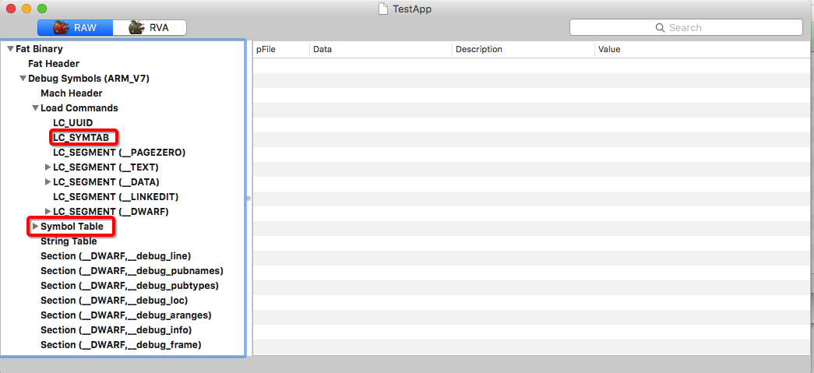
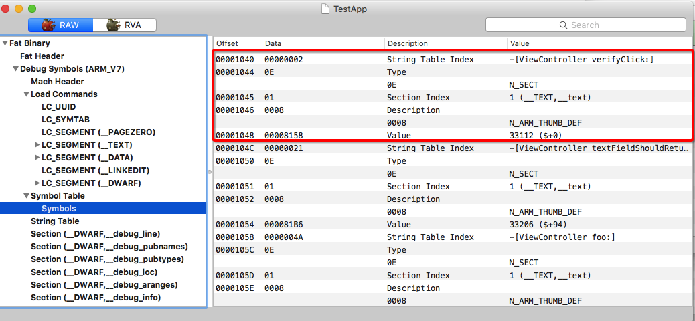
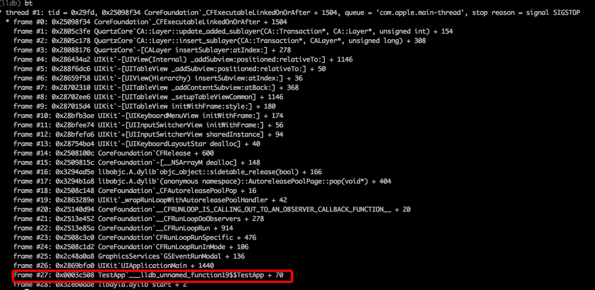
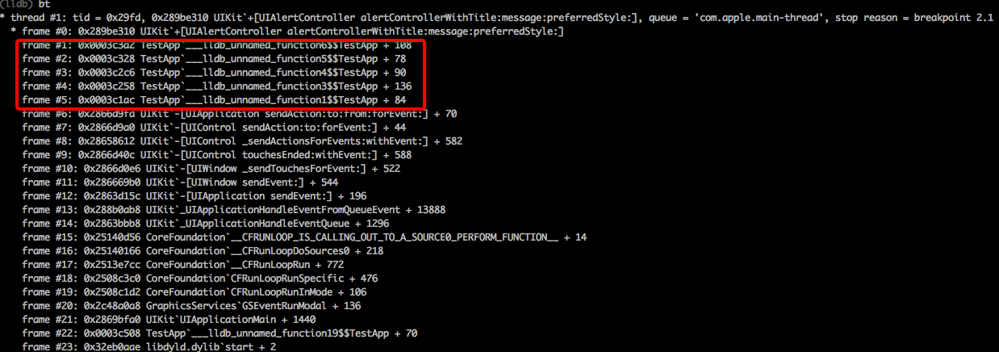
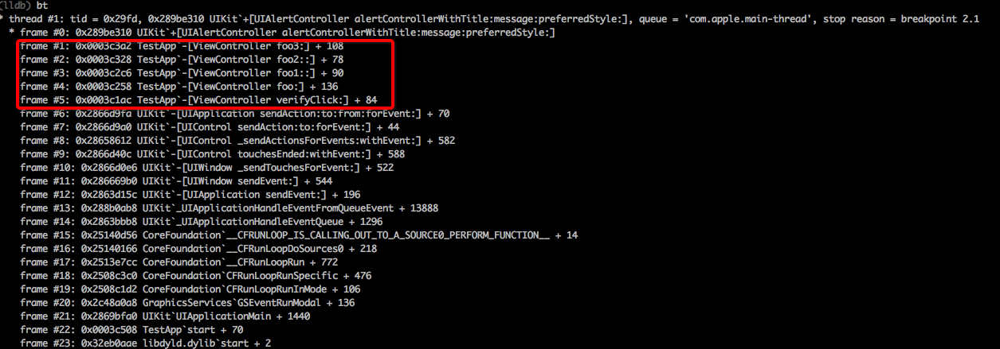

# For Better iOS Debug : 重建符号表
---

## 缘起

1. 如果你有研究其他`App`的习惯，那你一定已经知道了以下这些信息。
	1. 总体来说，研究方法分为`静态分析`和`运行分析`两种。前者对可执行二进制文件本身进行分析，无需运行程序，工具如`class-dump`, `IDA Pro`等, 后者对运行起来的『进程』（而非『程序』）进行分析，工具如`Reveal`, `cycript`, `jailbreak Tweak`, `lldb`等。`IDA Pro`与`lldb`分别是两大阵营的大杀器。
	2. 一般情况下，大家会先通过`Reveal`,`class-dump`等工具大致的猜测下，缩小想要重点研究的目标范围。当确认可以深入研究的时候，就可以进入`IDA Pro` + `lldb`结合分析的方式了。`IDA Pro`用来白盒观察完整逻辑，而`lldb`则可以通过**断点**, **调用堆栈**, **输出参数与返回值**等方式黑盒观察完整逻辑（并可以验证白盒下的推测，毕竟对着`IDA Pro`看上几天难免会犯一些错误）
	3. 但使用`lldb`有个问题，即调试过程中你会发现如果调试的对象是系统组件，如`MessageUI.framework`（主要用于发送信息和邮件）, 调用堆栈可以正常显示方法名，简单易懂。但如果你调试一个**非系统应用**，如`微信`，那么`lldb`中只会出现``MicroMessage\`___lldb_unnamed_symbol36$$MicroMessage + 70`` 之类的字样，完全不知道这个函数做了什么事情，要知道**一个有意义的名字对于逆向是多么多么的重要！！**
	4. 但是`IDA Pro`却可以从多个角度分析二进制文件，猜测出很多结果（比如根据`classname`与`selector`自动给对应的实现函数命名；根据函数调用指令，自动识别函数开始位置；以及通过对相关指令监控，从而确定函数的结束位置等）。这些猜测结果如果我们善加利用，便可以辅助我们的`lldb`调试过程。这个借鉴有很多思路，可以侵入，也可以外挂，本文尝试通过**将`IDA Pro`数据库内容导出成符号表**这一思路将`IDA Pro`的信息带入到`lldb`中来。
2. `2016-08-08`, `IDA Pro 6.95`发布，在 [What's new in IDA 6.95.160808](https://www.hex-rays.com/products/ida/6.95/index.shtml) 中，作者提到了其重新加入了`iOS debugger`, 真是让人眼馋的功能。从此`IDA Pro`动态分析的功能又回到了`iOS`世界中。但`IDA Pro`的授权费确实太贵，实在是买不起（其实主要是自己没钱显得贵），怎么办呢？『自己动手，丰衣足食』，那就我们自己构建一个『简易的iOS调试器』吧（当然还是基于`lldb`）。这其中就需要我们自行讲`IDA Pro`的信息桥接到`lldb`中，本文重建符号表便是这个思路下的第一步尝试。
3. 即使你不搞逆向，也对研究其他`App`没啥兴趣。但有一种事件你要预防，虽然他是小概率事件，但一旦发生便很惨。这就是**线上版本符号表信息丢失**.我们知道现在有很多团队是自行分析崩溃日志的（而不是借助`iTunes Connect`），这就需要自己托管符号信息，上传到崩溃分析系统。而符号表信息一旦丢失，线上的崩溃便无法解开，此时如果有大面积的崩溃出现，你就只能对着一串串的内存地址干瞪眼，毫无办法。那本文提供的重建符号表的方式，也可以解决你的燃眉之急。

综上所述，便是这篇文章的成因。

## 过程简述
要实现符号表的重建，换言之，要实现从`IDA Pro`数据库到创建`dSYM`，我们按照以下内容去将整个思路走通。

1. 首先要搞清楚符号表需要什么信息，由于我们要创建的符号表内容仅仅是函数，那么其实我们只需要三个东西: `函数名称`, `起始地址`, `结束地址` 就可以了。
1. 搞清楚符号表需要什么信息之后，接下来就是`IDA Pro`数据库的信息怎么导出来的问题了。`IDA Pro`是支持编程接口的，所以我们可以写一个自动化的脚本导出我们想要的信息。在完整版`IDA Pro`中，官方提供了`Python`接口，大家可以开开心心的用`Python`来写这个自动化的脚本。
1. 但是大家还记得上文里我们提到过一个很重要的问题么？那就是**我们穷，买不起完整版啊！！**难道这篇文章到这里就神奇般的结束了？不不，怎么可能？虽然完整版我们买不起，但是官方放出来一个[评估版](https://www.hex-rays.com/products/ida/support/download_demo.shtml)给我们使用，虽然它有很多限制，以及用着用着就弹出个框告诉你你现在用的是`demo`版本，但是最重要的是**它是免费的！！**同时它竟然还带了原生的`IDC`语言支持（感谢仁慈的`Ilfak`），虽然是精简版的，但好歹可以用。于是我们终于可以通过这个<del>要吐槽我能吐槽它一天不带重样的</del>语言来编写自动化脚本了。
1. `IDA Pro`的事情搞定，接下来要看看那头：`dSYM`文件到底是什么。这个很快便能发现，一个`dSYM`实际上是个`bundle`，里面除了一个简单的`plist`，最重要的就是一个二进制文件，里面存放了符号信息。
2. 那我们既然要重建符号信息，那总得知道这个符号文件是啥格式吧。观察文件的`Magic Number`（一般是起始的一两个字节），发现是`CE FA ED FE`, 即`FEEDFACE`, 是我们熟知的`Mach-O`文件格式（即使不了解通过简单的搜索也可以获取）。
3. 既然是`Mach-O`文件，那么我们就通过 [`MachOView`](https://sourceforge.net/projects/machoview/) 工具来学习一个已有的`dSYM`吧。它大概看起来是这样的。

	
	
1. 眼尖的我们很快就发现一个名字叫`Symbol Table`部分，这看起来就是我们要找的符号表了，简单的分析了下（感谢`MachOView`的直观展示），其由文件头部的名为`LC_SYMTAB`的`Load Command`定义，表示一个函数符号的列表，每个符号包含如下信息：
	1. **名称**。要注意，它的名称并不是直接存在`Symbol Table`中的。相替代的，它将所有的名称都存在了一个名字叫做`String Table`的部分里，然后`Symbol Table`引用了其偏移量。
	1. **Section Index**。我们知道无论是`mach-o`，还是`PE`，或者是`Elf`，都是将一个可执行文件分为多个`Segment`，每个`Segment`分为多个`Section`，代码和数据便根据自己的特点放在了许多`Section`中。这里的`Section Index`即标示了这个函数代码是放在了哪个`Section`中。
	1. **起始地址**。函数代码的起始地址，这里要注意的是，实际上其记录的是函数代码在**可执行文件**的偏移量，并不是进程内存的偏移量。
	
	
	
1. 对上一步骤得到的三个数据一一攻克。
	1. 首先是名称，这个没啥难度，将所有函数名称收集一下，依次以`0`分割放在`String Table`中，同时记录下偏移量以备`Symbol Table`使用即可。
	2. 接下来是`Section Index`。这里有两个选择，第一，照着可执行文件抄一份`Segment`和`Section`的声明，然后建立`Symbol Table`的时候函数地址落在哪个`Section`便使用哪个`Section Index`。还有个方式就是只建立一个`Section`，然后声明下我们的函数都落在这个`Section`中，这个方法需要验证`lldb`的兼容性（毕竟符号文件和可执行文件不一致了）。
	3. 最后是`起始地址`。这里没啥问题。
1. 好，`IDA Pro`数据来源搞清楚了，也理解了`dSYM`如何格式化了，那接下来是不是就可以开始重建符号表了呢？不不，还差最后一个问题要搞清楚，即**lldb如何确定一个可执行文件和一个符号文件是相符的**。如果不了解这个问题，即使我们重建了符号表，`lldb`不认我们也没办法。不过这个问题倒是不难解决，这个奥秘就在一个叫做`LC_UUID`的`Load Command`中，当`lldb`在寻找符号表时要验证这个地方记录的`UUID`，只有可执行文件和符号文件的`UUID`相同，`lldb`才会『尝试』去加载这个符号表。

# 最终实现

搞定所有事情，接下来就是实现代码将其串联起来了。代码放在了[https://github.com/imoldman/DSYMCreator](https://github.com/imoldman/DSYMCreator)，简要介绍下代码组成。

- `doc`内是文档，`test`是一个测试工程，这些不是主要代码部分。

- `toolchain`放置了我们整个过程使用到的工具。
	- 其中`IDAScript`目录放置了给`IDA Pro`使用的自动化脚本。 `all.idc`就是那个将`IDA Pro`结果导出的自动化脚本，其接收一个表示存放地址的路径，然后会将每个函数的名称，起始地址，结束地址都输出到这个文件上。

- 需要详细介绍的是`DSYMCreator`工具，其源码位于`src`内，我将其`build`的结果放了一份在`toolchain`里，其工作就是本文上面描述的内容。其命令行大概看起来是这样的。

	```shell
	$ ./DSYMCreator --uuid 	"14494083-a184-31e2-946b-3f942a402952" --raw_ida_symbol "/tmp/symbols.txt" --output /path/to/save/loadable_symbol
	```
	
	大致解释一下。
	- `uuid`, 即为上文中提到的可执行文件的`uuid`, 构建符号表要用到
	- `raw_ida_symbol` 即为从`IDA Pro`中获取的符号数据
	- `output` 顾名思义，即为导出的符号表文件。
- 根目录的`main.py`是一个整合脚本，下文详述。
	
# 如何重建
大家估计一听上面介绍就疯了，这都是啥跟啥啊？这工具到底咋用啊？

不要着急，为了照顾大家的心情，本工具在有限的条件下做足了优化，使得大家**根本就不用关心IDA Pro**是怎么使用的，所有过程都是**自动化或半自动化完成的**（之所以还有『半自动化』的，实在是条件有限，`IDA Pro`评估版限制太多，大家多体谅。。。）

**以下是最终使用方式**。

> 0. <div style="color:red">如果二进制文件有壳，先将其砸掉，注意取`armv7`版本</div>
> 1. <div style="color:red">`$ ./main.py /path/to/binary/xxx`</div>
> 2. <div style="color:red">其实你的工作已经基本结束了，`IDA Pro`会自动打开并自动开始工作，然后可能需要你点两三次`OK`（这就是前面提到的『半自动化』部分），之后等待`IDA Pro`自动退出。</div>
> 3. <div style="color:red">此时在与`main.py`同级目录下会生成一个名为`xxx.symbol`的文件，这个文件即为我们重建的符号文件。</div>

# 验证
生成了符号文件，测试一下是不是可以正常使用呢？为了国内开发环境的和谐，本文就不采用真实案例作为目标对象了。相替代的，我在`test`目录下放置了一个小工程，其中模拟了一个登陆操作，其会将密码做一定校验，如果校验出错会弹框提醒，如果校验成功，会什么都不做，我们的目标就是搞定这个函数。

0. 提前找台`32 Bit`的越狱机器（由于`IDA Pro`评估版只支持`32`位，因此此处必须找一个`32 Bit`的越狱机器），并提前部署好响应版本的`debugserver`。
1. 使用该越狱设备去[http://fir.im/dsymtest](http://fir.im/dsymtest) 安装这个示例工程（已经`strip`过`debug info`)。
2. 在设备上启动这个应用。`ssh`登录这台设备，并输入如下命令，让`debugserver`监听`1234`接口，等待我们连入。

	```shell
	$ ./debugserver *:1234 -a "TestApp" #假设debugserver在当前目录
	```
	
2. 在`mac`上使用`lldb`，输入如下命令

	```shell
	$ lldb
	(lldb) platform select remote-ios
	(lldb) process connect connect://192.168.2.6:1234  #假设192.168.2.6是设备的ip，输入完这个命令后需要等待一些时间
	(lldb) bt # 输入当前堆栈
	```
	
3. 在上一步骤的堆栈中，你会看到类似这样的内容。

   
   
   显然`main`函数没有被识别出来。这个时候我们使用下面的命令设置`UIAlertController`的断点（想观察密码校验出错弹框的调用堆栈）。
   
   ```shell
   (lldb) br s -r ".*UIAlertController alertControllerWithTitle.*" #给名称中包含UIAlertController alertControllerWithTitle的函数都加上断点
   (lldb) c  # 继续执行，让程序跑起来
   ```
   
   此时我们在密码框里输入`1`（为什么要输入`1`，是因为代码是我写的，我知道怎样会验证失败，哈哈。其实这里就是一个重现步骤的问题，在真实案例中需要大家自行准备）。调试器会停下来，并提示我们命中了断点，此时我们输入如下命令
   
   ```shell
   (lldb) bt  #观察当前的堆栈
   ```
   
   此时你会得到类似这样的结果。
   
   
   
   很明显，以`TestApp`开头的符号没有被正常解析出来。
 
4. 现在该我们的主角登场了，新开一个终端，`ssh`到设备，输入如下命令
 
 	```shell
 	$ ps aux | grep TestApp
 	```
 	
 	这一步的目的是为了获取`TestApp`的二进制文件路径，获取到了之后退出`ssh`，使用如下命令讲可执行文件复制到本地（我在仓库里放了一份二进制文件，大家也可以用这份`/test/bin/TestApp`），并重建符号表
 	
 	```shell
 	$ scp root@192.168.2.6:/var/mobile/Containers/Bundle/Application/E3636785-6885-4193-B740-D7E39F9C85BD/TestApp.app/TestApp /path/to/TestApp
 	$ ./main.py /path/to/TestApp
 	```
  	
 	这样在`main.py`同目录下就会生成一个名为`TestApp.symbol`的文件，此即为重建好的符号文件
 	
5. 将符号文件加载到`lldb`中, 并观察调用堆栈验证。使用如下命令。
 
 	```shell
 	(lldb) target symbols add /path/to/TestApp.symbol
 	(lldb) bt
 	```
 	
6. 此时输入结果中包含了符号化的信息，如下图，我们的重建过程成功。

 	 
 	 
7. 调用堆栈搞定了，很明显是这个 `-[ViewController foo3:]` 搞的鬼，打个断点看看他输入参数是啥吧，恩。
 
	```shell
	(lldb) br s -n "-[ViewController foo3:]"
	Breakpoint 2: no locations (pending).
   WARNING:  Unable to resolve breakpoint to any actual locations.
	```
	
	我擦，什么情况？！断点打不上？什么鬼？哪里出问题了？
	
	其实问题的原因是：<dev style="color:red">**我们刚才重建的符号表根本就不是完整的，跟lldb无法完美兼容**</dev>。在下一篇中大家将会看到通过恢复`DWARF`信息，我们是如何构建一份**完整**的符号表，进而支持设置断点操作的。
	
	（容我先去睡觉回个血。。。。）
	
	全文完。