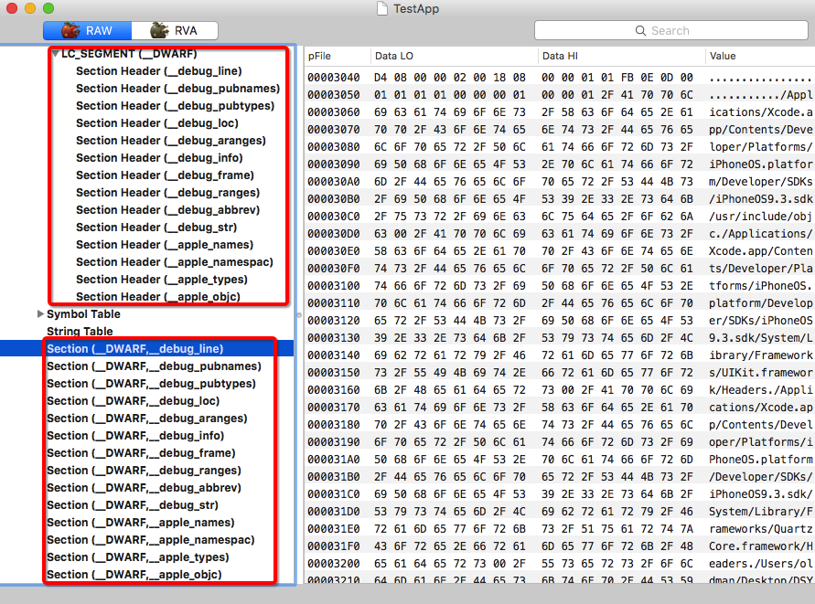
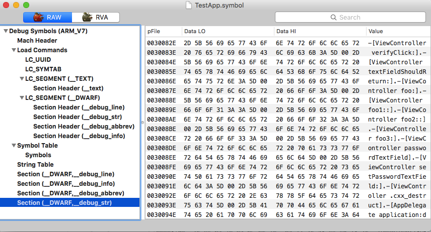
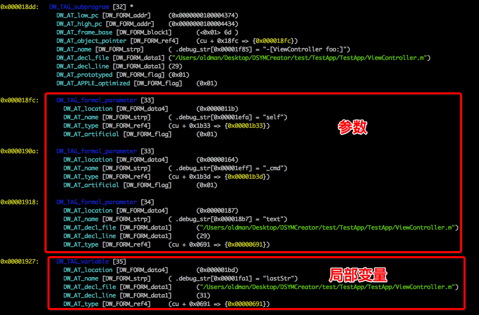

# For Better iOS Debug : 重建DWARF段
---


## 为什么要打断点

书接上回。

上回说到我们千辛万苦制作的符号表文件可以使得`lldb`显示堆栈时正确显示函数名，但是却不能设置断点。要知道不能设置断点是个很大的遗憾。逆向时，我们常常需要在某个函数开始时设置断点。这样设置断点主要有以下几个好处。

- **观察传入参数**。虽然我们可以通过`class-dump`获取函数名，也可以顺带获取函数的参数类型，但如果参数都`OC`对象，由于所有`OC`对象本质上都是一样的，所以`class-dump`只会弱弱的显示一个`id`，如下例。

	```Objective-C
	- (id)formatUser:(id)arg1 withOptions:(id)arg2;
	```
	
	一个`id`用处有限，比如上例，根本无法获知这个函数的参数和返回值类型是什么，那我们逆向的思路就断在这里了。此时通过`cycript`, `jailbreak tweak`, `lldb`等方式动态调试一下就很有必要。
	另外，有时候只知道参数类型是没有用的，这个时候还需要知道参数的值，在函数开始时设置断点也很有用。
	
- **观察调用堆栈**。有时候你察觉到某个函数是整个逆向过程的关键，你通过`IDA Pro`查阅了其逻辑代码，大致理解了它做什么事情之后，现在你的任务是观察它的上下游，搞定整个流程。此时你在这个函数开始的位置打个断点，然后观察其调用堆栈，就知道了到底是哪些函数调用了它，为进一步的逆向做好准备。
- **找delegate**。很多时候，我们通过`IDA Pro`看代码，发现某个地方有个对`XXXDelegate`的调用，我们想深入这个里面看看，但是由于`delegate`是运行时设置进去的，所以静态分析无法直接跳转进入到`delegate`的实现。相替代的，我们可以去`class-dump`中搜索有哪些类实现了这个名为`XXXDelegate`的`Protocol`，如果这个`Protocol`实现的类的个数比较少还好说，可以一个一个的设置断点，命中哪个就是哪个。但如果这个`Protocol`实现的类的个数特别多，依次设置断点根本不可能；或者根本找不到任何一个实现了这个`Protocol`的类，断点无法设置，这两种情况都会使我们陷入困境。此时你需要使用下面的命令设置断点。
	
	```shell
	(lldb) breakpoint set --selector "downloader:downloadImageFinished:"
	# 或简写为
	(lldb) br s -S "downloader:downloadImageFinished:"
	```
	
	该命令是告诉`lldb`将『所有』`downloader:downloadImageFinished:`的`selector`对应的实现函数全部打上断点。打上断点之后，我们运行程序，触发重现流程，断点即会命中，这个时候观察下调用堆栈，就知道到底是哪个类实现了这个`Protocol`
	
说一千道一万，吹了这么多，还是要搞定『为什么做好符号表但是断点无法打上』的问题。

## 理论准备

先考虑下从理论上我们是不是漏掉了什么。猜测一下，当我们打断点的时候发生什么事情呢？

显然我们这里的断点都不是直接打给内存地址的，即`address breakpoint`。相反，我们打断点的时候使用了函数名，也就是说调试器在真正打断点前需要先将我们给定的函数名转化为内存地址，也就是有一个`name -> address`的对应关系。

这个过程一共有两步。

1. 从符号表中查询该`name`对应的记录，要注意，这里的记录其实是代码在可执行文件的偏移量。
2. 讲上一步骤得到的结果映射成进程内的内存地址`address`。

接下来`lldb`对这个内存打断点就可以了。

整个过程用到符号表的只有第一步，换言之只要我们有一个『存储了函数名称和代码地址』的符号表，整个问题就搞定了，我们的断点应该就可以打上了。

可现在的情况是我们确实有符号表，但也确实打不上断点。

哪里出问题了呢？

## DWARF

『解铃还须系铃人』，既然是`lldb`告诉我们断点打不上，那就看下到底它的逻辑是啥吧。所幸`lldb`全部开源，『源码面前，了无秘密』。

如何获取和构建`lldb`，大家可以在[官网](http://lldb.llvm.org/build.html)找到。这里就不详述了。总之经过大致的浏览，很快就会发现，我们的问题多半跟一个类型名称叫做`DWARF`的符号表有关。

那什么是`DWARF`呢？如果你注意观察的话，其实平时我们接触过这个名词。一个`dSYM Bundle`文件组成看起来是这样的。

```shell
$ tree
.
└── TestApp.app.dSYM
    └── Contents
        ├── Info.plist
        └── Resources
            └── DWARF
                └── TestApp
```

这里就有一个名字叫做`DWARF`的目录，暗示了`TestApp.app.dSYM`中的符号表就是`DWARF`格式。那么他跟我们自行创建的符号表有啥区别呢？我们还是通过`MachOView`来看一下。



很明显，它多了一个名字叫`__DWARF`的`segment`, 其下有一堆的`section`: `__debug_info`, `__debug_line`, `__debug_str`等等。看样子这确实是跟调试有关的东西。会不会是我们缺少这些信息导致我们无法打断点呢？

还是得先搞清楚`DWARF`到底是什么东西。

经过简单的搜索，我们得知，`DWARF`实际上是一种符号表的格式，苹果的开发人员借用了这个格式来放放置调试符号。[这里](http://wiki.dwarfstd.org/index.php?title=Apple%27s_%22Lazy%22_DWARF_Scheme)还简要记录了当年他们的『心路历程』。

## 不可或缺的sections

了解完`DWARF`是什么东西，那么我们回过来看下`lldb`是怎么使用的。经过一番查阅，发现原来**必须包含`__debug_str`, `__debug_line`, `__debug_abbrev`, `__debug_info`四个`section`，`lldb`才认为这是一个合法的`DWARF`符号表**（相关代码见注1)。

那就来看看这几个`section`分别代表啥意思吧。经过源码和多种工具（如`dwarfdump`）相结合的方式，最终得到如下的成果。

- **`__debug_line`**, 这个记录了源代码的行号。我们从可执行文件中显然是分析不出啥行号的，这个`section`留空就好了，反正只是骗骗`lldb`用。
- **`__debug_str`**, 这个跟上一篇提到的`String Table`比较像，记录了所有需要用到的字符串，然后其他`section`使用偏移量来引用字符串。
- **`__debug_abbrev`**和**`__debug_info`**。这俩是一个整体，共同合作来记录调试需要的数据，需要一起解释。

	通俗的来讲，`__debug_abbrev`中记录的是`key`, `__debug_info`中记录的是`value`。我们以代码作为例子类比下，对于`uint32_t foo = 42;`, 这里可以看做是有一个名字叫做`foo`并占用了`4`字节的`key`，其`value`是`42`。那么我们可以将`foo`和`4`写入`__debug_abbrev`中，将`42`写入`__debug_abbrev`中。
	
## 最终实现

罗里吧嗦说了一堆，再加上根本不知道怎么说的数据结构细节，我们最终将符号表写了一份到`DWARF`段中。代码还是放在了github上：[https://github.com/imoldman/DSYMCreator](https://github.com/imoldman/DSYMCreator)。还有上一篇提到的方式生成符号表并导入。

现在可以打断点拉。

来张最终的符号表结构。



--
注:

1. `lldb`中如何判断一个`DWARF`符号表文件是合法的，相关代码如下。

	- [SymbolFileDWARF.cpp:584-647](https://github.com/llvm-mirror/lldb/blob/master/source/Plugins/SymbolFile/DWARF/SymbolFileDWARF.cpp#L584-L647), 这段代码枚举符号文件里的`section`，然后根据有哪些`section`来判断这个符号表支持哪些特性（这里面就是探测了正文部分提到的四个`section`)。
	- [SymbolFile.cpp:58-66](https://github.com/llvm-mirror/lldb/blob/master/source/Symbol/SymbolFile.cpp#L58-L66)，这段代码生成了一个符号表，然后判断一下是不是支持了`kAllAbilities`(即所有特性），那到底这个`kAllAbilities`包含哪些特性呢？
	- [SymbolFile.h:36-45](https://github.com/llvm-mirror/lldb/blob/master/include/lldb/Symbol/SymbolFile.h#L36-L45)，原来`kAllAbilities`即包含`SymbolFileDWARF.cpp`中所列的所有特性，所以，我们要支持`__debug_str`, `__debug_line`, `__debug_abbrev`, `__debug_info`四个`section`，缺一不可。

2. 事实上，`__debug_abbrev`与`__debug_info`中记录的远远不止是函数名称和地址的对应关系，它里面记录了**所有**调试过程中用到的信息。下面是个简化版的例子来跟大家直观感觉下它们里面有什么。

		

	这里面有些数据其实也可以从`IDA Pro`中导出出来，这也是接下来的工作内容之一。