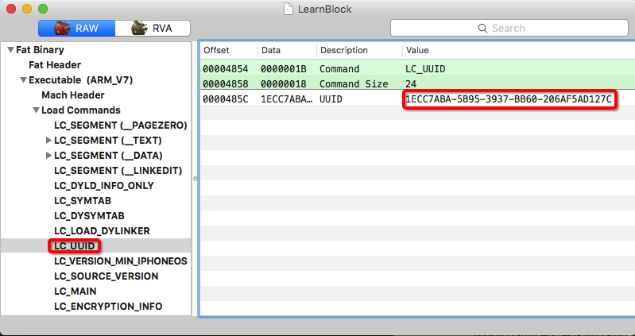

# 高效逆向 - 为任意iOS App生成符号表
---

## 缘起

1. 如果你有研究其他`App`的习惯，那你一定已经知道了以下这些信息。
	1. 总体来说，研究方法分为`静态分析`和`运行分析`两种。前者对可执行二进制文件本身进行分析，无需运行程序，工具如`class-dump`, `IDA Pro`等, 后者对运行起来的『进程』（而非『程序』）进行分析，工具如`Reveal`, `cycript`, `jailbreak Tweak`, `lldb`等。`IDA Pro`与`lldb`分别是两大阵营的大杀器。
	2. 一般情况下，大家会先通过`Reveal`,`class-dump`等工具大致的猜测下，缩小想要重点研究的目标范围。当确认可以深入研究的时候，就可以进入`IDA Pro` + `lldb`结合分析的方式了。`IDA Pro`用来白盒观察完整逻辑，而`lldb`则可以通过**断点**, **调用堆栈**, **输出参数与返回值**等方式黑盒观察完整逻辑（并可以验证白盒下的推测，毕竟对着`IDA Pro`看上几天难免会犯一些错误）
	3. 但使用`lldb`有个问题，即调试过程中你会发现如果调试的对象是系统组件，如`MessageUI.framework`（主要用于发送信息和邮件）, 调用堆栈可以正常显示方法名，简单易懂。但如果你调试一个**非系统应用**，如`微信`，那么`lldb`中只会出现``MicroMessage`___lldb_unnamed_symbol36$$MicroMessage + 70`` 之类的字样，完全不知道这个函数做了什么事情，要知道**一个有意义的名字对于逆向是多么多么的重要！！**
	4. 可是`IDA Pro`却可以从多个角度分析二进制文件，猜测出很多结果（比如根据`classname`与`selector`自动给对应的实现函数命名；根据函数调用指令，自动识别函数开始位置；以及通过对相关指令监控，从而确定函数的结束位置等）。这些猜测结果如果我们善加利用，便可以辅助我们的`lldb`调试过程。这个借鉴有很多思路，可以侵入，也可以外挂，本文尝试通过**将`IDA Pro`数据库内容导出成符号表**这一思路将`IDA Pro`的信息带入到`lldb`中来。
2. `2016-08-08`, `IDA Pro 6.95`发布，在 [What's new in IDA 6.95.160808](https://www.hex-rays.com/products/ida/6.95/index.shtml) 中，作者提到了其重新加入了`iOS debugger`, 真是让人眼馋的功能。从此`IDA Pro`动态分析的功能又回到了`iOS`世界中。但`IDA Pro`的授权费确实太贵，实在是买不起，怎么办呢？『自己动手，丰衣足食』，那就我们自己构建一个『简易的iOS调试器』吧（当然还是基于`lldb`）。这其中就需要我们自行讲`IDA Pro`的信息桥接到`lldb`中，本文重建符号表便是这个思路下的第一步尝试。
3. 即使你不搞逆向，也对研究其他`App`没啥兴趣。但有一种事件你要预防，虽然他是小概率事件，但一旦发生便很惨。这就是**线上版本符号表信息丢失**。我们知道现在有很多团队是自行分析崩溃日志的（而不是借助`iTunes Connect`），这就需要自己托管符号信息，上传到崩溃分析系统。而符号表信息一旦丢失，线上的崩溃便无法解开，此时如果有大面积的崩溃出现，你就只能对着一串串的内存地址干瞪眼，毫无办法。那本文提供的重建符号表的方式，也可以解决你的燃眉之急。

综上所述，便是这篇文章的成因。

## 过程简述
要实现符号表的重建，换言之，要实现从`IDA Pro`数据库到创建`dSYM`，我们按照以下内容去将整个思路走通。

1. 首先要搞清楚符号表需要什么信息，由于我们要创建的符号表内容仅仅是函数，那么其实我们只需要三个东西: `函数名称`, `起始地址`, `结束地址` 就可以了。
1. 搞清楚符号表需要什么信息之后，接下来就是`IDA Pro`数据库的信息怎么导出来的问题了。`IDA Pro`是支持编程接口的，所以我们可以写一个自动化的脚本导出我们想要的信息。在完整版`IDA Pro`中，官方提供了`Python`接口，大家可以开开心心的用`Python`来写这个自动化的脚本。
1. 但是大家还记得上文里我们提到过一个很重要的问题么？那就是**我们买不起完整版啊！！**难道这篇文章到这里就神奇般的结束了？不不，怎么可能？虽然完整版我们买不起，但是官方放出来一个[评估版](https://www.hex-rays.com/products/ida/support/download_demo.shtml)给我们使用，虽然它有很多限制，以及用着用着就弹出个框告诉你你现在用的是`demo`版本，但是最重要的是**它是免费的！！**同时它竟然还带了原生的`IDC`语言支持，虽然是精简版的，但好歹可以用。于是我们终于可以通过这个<del>要吐槽我能吐槽它一天不带重样的</del>语言来编写自动化脚本了。
1. `IDA Pro`的事情搞定，接下来要看看那头：`dSYM`文件到底是什么。这个很快便能发现，一个`dSYM`实际上是个`bundle`，里面除了一个简单的`plist`，最重要的就是一个二进制文件，里面存放了符号信息。
2. 那我们既然要重建符号信息，那总得知道这个符号文件是啥格式吧。观察文件的`Magic Number`（一般是起始的一两个字节），发现是`CE FA ED FE`, 即`FEEDFACE`, 是我们熟知的`Mach-O`文件格式（即使不了解通过简单的搜索也可以获取）。
3. 既然是`Mach-O`文件，那么我们就通过 [`MachOView`](https://sourceforge.net/projects/machoview/) 工具来学习一个已有的`dSYM`吧。它大概看起来是这样的。

	
	
1. 眼尖的我们很快就发现一个名字叫`Symbol Table`部分，这看起来就是我们要找的符号表了，简单的分析了下（感谢`MachOView`的直观展示），其由文件头部的名为`LC_SYMTAB`的`Load Command`定义，表示一个函数符号的列表，每个符号包含如下信息：
	1. **名称**。要注意，它的名称并不是直接存在`Symbol Table`中的。相替代的，它将所有的名称都存在了一个名字叫做`String Table`的部分里，然后`Symbol Table`引用了其偏移量。
	1. **Section Index**。我们知道无论是`mach-o`，还是`PE`，或者是`Elf`，都是将一个可执行文件分为多个`Segment`，每个`Segment`分为多个`Section`，代码和数据便根据自己的特点放在了许多`Section`中。这里的`Section Index`即标示了这个函数代码是放在了哪个`Section`中。
	1. **起始地址**。函数代码的起始地址，这里要注意的是，实际上其记录的是函数代码在**可执行文件**的偏移量，并不是进程内存的偏移量。
	
	
	
1. 对上一步骤得到的三个数据一一攻克。
	1. 首先是名称，这个没啥难度，将所有函数名称收集一下，依次以`0`分割放在`String Table`中，同时记录下偏移量以备`Symbol Table`使用即可。
	2. 接下来是`Section Index`。这里有两个选择，第一，照着可执行文件抄一份`Segment`和`Section`的声明，然后建立`Symbol Table`的时候函数地址落在哪个`Section`便使用哪个`Section Index`。还有个方式就是只建立一个`Section`，然后声明下我们的函数都落在这个`Section`中，这个方法需要验证`lldb`的兼容性（毕竟符号文件和可执行文件不一致了）。
	3. 最后是`起始地址`。这里没啥问题。
1. 好，`IDA Pro`数据来源搞清楚了，也理解了`dSYM`如何格式化了，那接下来是不是就可以开始重建符号表了呢？不不，还差最后一个问题要搞清楚，即**lldb如何确定一个可执行文件和一个符号文件是相符的**。如果不了解这个问题，即使我们重建了符号表，`lldb`不认我们也没办法。不过这个问题倒是不难解决，这个奥秘就在一个叫做`LC_UUID`的`Load Command`中，当`lldb`在寻找符号表时要验证这个地方记录的`UUID`，只有可执行文件和符号文件的`UUID`相同，`lldb`才会『尝试』去加载这个符号表。

	

# 实现

搞定所有事情，接下来就是实现代码将其串联起来了。代码放在了[https://github.com/imoldman/DSYMCreator](https://github.com/imoldman/DSYMCreator)，简要介绍下代码组成。

- `doc`内是文档，`test`是一个测试工程，这些不是主要代码部分。

- `toolchain`放置了我们整个过程使用到的工具。
	- 其中`IDAScript`目录放置了给`IDA Pro`使用的自动化脚本。 `all.idc`就是那个将`IDA Pro`结果导出的自动化脚本，其接收一个表示存放地址的路径，然后会将每个函数的名称，起始地址，结束地址都输出到这个文件上。

- 需要详细介绍的是`DSYMCreator`工具，其源码位于`src`内，我将其`build`的结果放了一份在`toolchain`里，其工作就是本文上面描述的内容。其命令行大概看起来是这样的。

	```shell
	$ ./DSYMCreator --uuid 	"14494083-a184-31e2-946b-3f942a402952" --raw_ida_symbol "/tmp/symbols.txt" --dwarf_section_vmbase 0x40000 --output /path/to/save/loadable_symbol
	```
	
	大致解释一下。
	- `uuid`, 即为上文中提到的可执行文件的`uuid`, 构建符号表要用到
	- `raw_ida_symbol` 即为从`IDA Pro`中获取的符号数据
	- `dwarf_section_vmbase`, 这个稍微有点复杂。由于符号文件和可执行文件描述的实际是一个程序，因此他们的`segment`和`section`要保证兼容。其中这里的一条要求就是`dwarf`数据不能跟代码数据覆盖，此参数就是用来指定`dwarf`在进程内存中的起始地址的。
	- `output` 顾名思义，即为导出的符号表文件。
- 根目录的`main.py`是一个整合脚本，下文详述。
	
# 如何重建
大家估计一听上面介绍就疯了，这都是啥跟啥啊？这工具到底咋用啊？

不要着急，为了照顾大家的心情，本工具在有限的条件下做足了优化，使得大家**根本就不用关心IDA Pro**是怎么使用的，所有过程都是**自动化或半自动化完成的**（之所以还有『半自动化』的，实在是条件有限，`IDA Pro`评估版限制太多，大家多体谅。。。）

**以下是最终使用方式**。

> 0. <div style="color:red">如果二进制文件有壳，先将其砸掉，注意取`armv7`版本</div>
> 1. <div style="color:red">`$ ./main.py --input /path/to/binary/xxx`</div>
> 2. <div style="color:red">其实你的工作已经基本结束了，`IDA Pro`会自动打开并自动开始工作，然后可能需要你点两三次`OK`（这就是前面提到的『半自动化』部分），之后等待`IDA Pro`自动退出。</div>
> 3. <div style="color:red">此时在与输入的可执行文件`xxx`同级目录下会生成一个名为`xxx.symbol`的文件，这个文件即为我们重建的符号文件。</div>

# 验证
生成了符号文件，测试一下是不是可以正常使用呢？简单期间，本文就不采用真实案例作为目标对象了。相替代的，我在`test`目录下放置了一个小工程，其中模拟了一个登陆操作，其会将密码做一定校验，如果校验出错会弹框提醒，如果校验成功，会什么都不做，我们的目标就是搞定这个函数。

0. 提前找台`32`位的越狱机器（由于`IDA Pro`评估版只支持`32`位，因此此处必须找一个`32`位的越狱机器），并提前部署好响应版本的`debugserver`。
1. 使用该越狱设备去[http://fir.im/dsymtest](http://fir.im/dsymtest) 安装这个示例工程（已经`strip`过`debug info`)。
2. 在设备上启动这个应用。`ssh`登录这台设备，并输入如下命令，让`debugserver`监听`1234`接口，等待我们连入。

	```shell
	$ ./debugserver *:1234 -a "TestApp" #假设debugserver在当前目录
	```
	
2. 在`mac`上使用`lldb`，输入如下命令

	```shell
	$ lldb
	(lldb) platform select remote-ios
	(lldb) process connect connect://192.168.2.6:1234  #假设192.168.2.6是设备的ip，输入完这个命令后需要等待一些时间
	(lldb) bt # 输入当前堆栈
	```
	
3. 在上一步骤的堆栈中，你会看到类似这样的内容。

   
   
   显然`main`函数没有被识别出来。这个时候我们使用下面的命令设置`UIAlertController`的断点（想观察密码校验出错弹框的调用堆栈）。
   
   ```shell
   (lldb) br s -r ".*UIAlertController alertControllerWithTitle.*" #给名称中包含UIAlertController alertControllerWithTitle的函数都加上断点
   (lldb) c  # 继续执行，让程序跑起来
   ```
   
   此时我们在密码框里输入`1`（为什么要输入`1`，是因为代码是我写的，我知道怎样会验证失败，哈哈。其实这里就是一个重现步骤的问题，在真实案例中需要大家自行准备）。调试器会停下来，并提示我们命中了断点，此时我们输入如下命令
   
   ```shell
   (lldb) bt  #观察当前的堆栈
   ```
   
   此时你会得到类似这样的结果。
   
   
   
   很明显，以`TestApp`开头的符号没有被正常解析出来。
 
4. 现在该我们的主角登场了，新开一个终端，`ssh`到设备，输入如下命令
 
 	```shell
 	$ ps aux | grep TestApp
 	```
 	
 	这一步的目的是为了获取`TestApp`的二进制文件路径，获取到了之后退出`ssh`，使用如下命令讲可执行文件复制到本地（我在仓库里放了一份二进制文件，大家也可以用这份`/test/bin/TestApp`），并重建符号表
 	
 	```shell
 	$ scp root@192.168.2.6:/var/mobile/Containers/Bundle/Application/E3636785-6885-4193-B740-D7E39F9C85BD/TestApp.app/TestApp /path/to/TestApp
 	$ ./main.py --input /path/to/TestApp
 	```
  	
 	这样一个名为`/path/to/TestApp.symbol`的文件就产生了，此即为重建好的符号文件
 	
5. 将符号文件加载到`lldb`中, 并观察调用堆栈验证。使用如下命令。
 
 	```shell
 	(lldb) target symbols add /path/to/TestApp.symbol
 	(lldb) bt
 	```
 	
6. 此时输入结果中包含了符号化的信息，如下图，我们的重建过程成功。

 	 
 	 
7. 调用堆栈搞定了，很明显是这个 `-[ViewController foo3:]` 搞的鬼，打个断点看看他输入参数是啥吧，恩。
 
	```shell
	(lldb) br s -n "-[ViewController foo3:]"
	Breakpoint 2: no locations (pending).
   WARNING:  Unable to resolve breakpoint to any actual locations.
	```
	
	我擦，什么情况？！断点打不上？什么鬼？哪里出问题了？
	
	其实问题的原因是：<dev style="color:red">**我们刚才重建的符号表根本就不是完整的，跟lldb无法完美兼容**</dev>。哪怎样才能兼容呢，这还是要从『为什么要打断点』说起。
		
## 为什么要打断点

我们千辛万苦制作的符号表文件可以使得`lldb`显示堆栈时正确显示函数名，但是却不能设置断点。要知道不能设置断点是个很大的遗憾。逆向时，我们常常需要在某个函数开始时设置断点。这样设置断点主要有以下几个好处。

- **观察传入参数**。虽然我们可以通过`class-dump`获取函数名，也可以顺带获取函数的参数类型，但如果参数都`OC`对象，由于所有`OC`对象本质上都是一样的，所以`class-dump`只会弱弱的显示一个`id`，如下例。

	```Objective-C
	- (id)formatUser:(id)arg1 withOptions:(id)arg2;
	```
	
	一个`id`用处有限，比如上例，根本无法获知这个函数的参数和返回值类型是什么，那我们逆向的思路就断在这里了。此时通过`cycript`, `jailbreak tweak`, `lldb`等方式动态调试一下就很有必要。
	另外，有时候只知道参数类型是没有用的，这个时候还需要知道参数的值，在函数开始时设置断点也很有用。
	
- **观察调用堆栈**。有时候你察觉到某个函数是整个逆向过程的关键，你通过`IDA Pro`查阅了其逻辑代码，大致理解了它做什么事情之后，现在你的任务是观察它的上下游，搞定整个流程。此时你在这个函数开始的位置打个断点，然后观察其调用堆栈，就知道了到底是哪些函数调用了它，为进一步的逆向做好准备。
- **找delegate**。很多时候，我们通过`IDA Pro`看代码，发现某个地方有个对`XXXDelegate`的调用，我们想深入这个里面看看，但是由于`delegate`是运行时设置进去的，所以静态分析无法直接跳转进入到`delegate`的实现。相替代的，我们可以去`class-dump`中搜索有哪些类实现了这个名为`XXXDelegate`的`Protocol`，如果这个`Protocol`实现的类的个数比较少还好说，可以一个一个的设置断点，命中哪个就是哪个。但如果这个`Protocol`实现的类的个数特别多，依次设置断点根本不可能；或者根本找不到任何一个实现了这个`Protocol`的类，断点无法设置，这两种情况都会使我们陷入困境。此时你需要使用下面的命令设置断点。
	
	```shell
	(lldb) breakpoint set --selector "downloader:downloadImageFinished:"
	# 或简写为
	(lldb) br s -S "downloader:downloadImageFinished:"
	```
	
	该命令是告诉`lldb`将『所有』`downloader:downloadImageFinished:`的`selector`对应的实现函数全部打上断点。打上断点之后，我们运行程序，触发重现流程，断点即会命中，这个时候观察下调用堆栈，就知道到底是哪个类实现了这个`Protocol`
	
说一千道一万，吹了这么多，还是要搞定『为什么做好符号表但是断点无法打上』的问题。

## 理论准备

先考虑下从理论上我们是不是漏掉了什么。猜测一下，当我们打断点的时候发生什么事情呢？

显然我们这里的断点都不是直接打给内存地址的，即`address breakpoint`。相反，我们打断点的时候使用了函数名，也就是说调试器在真正打断点前需要先将我们给定的函数名转化为内存地址，也就是有一个`name -> address`的对应关系。

这个过程一共有两步。

1. 从符号表中查询该`name`对应的记录，要注意，这里的记录其实是代码在可执行文件的偏移量。
2. 讲上一步骤得到的结果映射成进程内的内存地址`address`。

接下来`lldb`对这个内存打断点就可以了。

整个过程用到符号表的只有第一步，换言之只要我们有一个『存储了函数名称和代码地址』的符号表，整个问题就搞定了，我们的断点应该就可以打上了。

可现在的情况是我们确实有符号表，但也确实打不上断点。

哪里出问题了呢？

## DWARF

『解铃还须系铃人』，既然是`lldb`告诉我们断点打不上，那就看下到底它的逻辑是啥吧。所幸`lldb`全部开源，『源码面前，了无秘密』。

如何获取和构建`lldb`，大家可以在[官网](http://lldb.llvm.org/build.html)找到。这里就不详述了。总之经过大致的浏览，很快就会发现，我们的问题多半跟一个类型名称叫做`DWARF`的符号表有关。

那什么是`DWARF`呢？如果你注意观察的话，其实平时我们接触过这个名词。一个`dSYM Bundle`文件组成看起来是这样的。

```shell
$ tree
.
└── TestApp.app.dSYM
    └── Contents
        ├── Info.plist
        └── Resources
            └── DWARF
                └── TestApp
```

这里就有一个名字叫做`DWARF`的目录，暗示了`TestApp.app.dSYM`中的符号表就是`DWARF`格式。那么他跟我们自行创建的符号表有啥区别呢？我们还是通过`MachOView`来看一下。


很明显，它多了一个名字叫`__DWARF`的`segment`, 其下有一堆的`section`: `__debug_info`, `__debug_line`, `__debug_str`等等。看样子这确实是跟调试有关的东西。会不会是我们缺少这些信息导致我们无法打断点呢？

还是得先搞清楚`DWARF`到底是什么东西。

经过简单的搜索，我们得知，`DWARF`实际上是一种符号表的格式，苹果的开发人员借用了这个格式来放放置调试符号。[这里](http://wiki.dwarfstd.org/index.php?title=Apple%27s_%22Lazy%22_DWARF_Scheme)还简要记录了当年他们的『心路历程』。

## 不可或缺的sections

了解完`DWARF`是什么东西，那么我们回过来看下`lldb`是怎么使用的。经过一番查阅，发现原来**必须包含`__debug_str`, `__debug_line`, `__debug_abbrev`, `__debug_info`四个`section`，`lldb`才认为这是一个合法的`DWARF`符号表**（相关代码见注1)。

那就来看看这几个`section`分别代表啥意思吧。经过源码和多种工具（如`dwarfdump`）相结合的方式，最终得到如下的成果。

- **`__debug_line`**, 这个记录了源代码的行号。我们从可执行文件中显然是分析不出啥行号的，这个`section`留空就好了，反正只是骗骗`lldb`用。
- **`__debug_str`**, 这个跟上一篇提到的`String Table`比较像，记录了所有需要用到的字符串，然后其他`section`使用偏移量来引用字符串。
- **`__debug_abbrev`**和**`__debug_info`**。这俩是一个整体，共同合作来记录调试需要的数据，需要一起解释。

	通俗的来讲，`__debug_abbrev`中记录的是`key`, `__debug_info`中记录的是`value`。我们以代码作为例子类比下，对于`uint32_t foo = 42;`, 这里可以看做是有一个名字叫做`foo`并占用了`4`字节的`key`，其`value`是`42`。那么我们可以将`foo`和`4`写入`__debug_abbrev`中，将`42`写入`__debug_abbrev`中。
	
## 最终实现

罗里吧嗦说了一堆，再加上根本不知道怎么说的数据结构细节，我们最终将符号表写了一份到`DWARF`段中。代码还是放在了[GitHub](https://github.com/imoldman/DSYMCreator)上，使用前文提到的方式生成符号表并导入。

现在可以打断点拉。

来张最终的符号表结构。


---
注：

1. 如果真的发生了**线上版本符号文件丢失**，除了本文的工具，还有个办法。
	1. 用当时的代码当时的环境，一样的配置参数，再打一个包
	2. 把`UUID`改成和线上版本的一致，记得`armv7`与`arm64`位分别有一个独立的`UUID`，都要改下。这样符号表就可以直接用了

1. `lldb`中如何判断一个`DWARF`符号表文件是合法的，相关代码如下。

	- [SymbolFileDWARF.cpp:584-647](https://github.com/llvm-mirror/lldb/blob/master/source/Plugins/SymbolFile/DWARF/SymbolFileDWARF.cpp#L584-L647), 这段代码枚举符号文件里的`section`，然后根据有哪些`section`来判断这个符号表支持哪些特性（这里面就是探测了正文部分提到的四个`section`)。
	- [SymbolFile.cpp:58-66](https://github.com/llvm-mirror/lldb/blob/master/source/Symbol/SymbolFile.cpp#L58-L66)，这段代码生成了一个符号表，然后判断一下是不是支持了`kAllAbilities`(即所有特性），那到底这个`kAllAbilities`包含哪些特性呢？
	- [SymbolFile.h:36-45](https://github.com/llvm-mirror/lldb/blob/master/include/lldb/Symbol/SymbolFile.h#L36-L45)，原来`kAllAbilities`即包含`SymbolFileDWARF.cpp`中所列的所有特性，所以，我们要支持`__debug_str`, `__debug_line`, `__debug_abbrev`, `__debug_info`四个`section`，缺一不可。